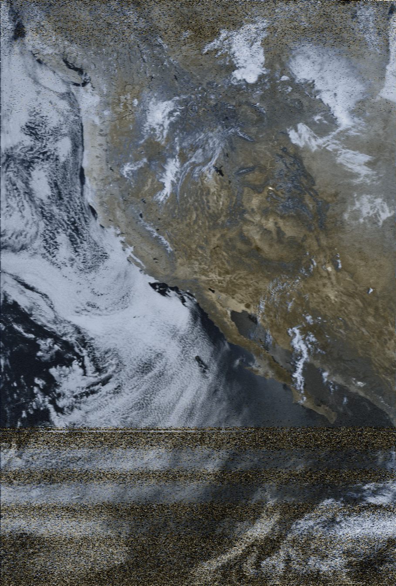

# NOAA APT Weather Satellite decoder
## Instructions
There many ways of doing it, but here is a procedure which worked for me:
1. Use gpredict to monitor NOAA 15, 18, and 19. Look for an upcoming pass which has high maximum elevation.
2. Use a V-dipole antenna with leg length of 53.4 cm.  The angle between the two legs should be 120 degrees. The V should be oriented horizontally with the point of the V pointing to the North.
3. Connect the antenna to a RTL-SDR receiver
4. Use GQRX to demodulate and record the signal to a wav file (see GQRX settings below)
5. You may need to make small adjustments to the frequency to account for the Doppler effect. Try to keep the filter centered on the signal. 
6. Run process_apt.py script to produce an image from the wav file

## GQRX settings
1. Tune to the correct center frequency -- NOAA 15: 137.620 MHz, NOAA 18: 137.9125 MHz, NOAA 19: 137.100 MHz
2. Filter width user -- adjust to 45 kHz
3. Mode: Narrow FM, click on dots to set Max dev = 25 kHz, and tau = 0
4. AGC: Off
5. Press "Rec" button near button right of screen.

